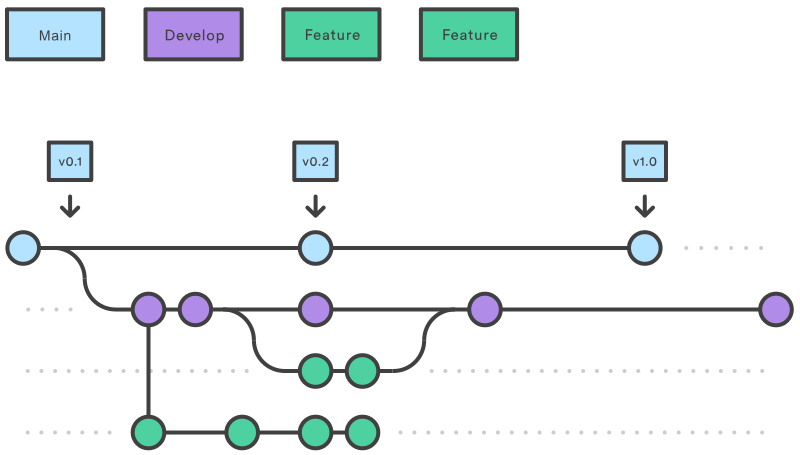

## 環境需求

- linux OR macOS
- Node.js 20+
- pnpm
- just (recommended)

## 環境變數設定

專案使用以下環境變數：

- `PUBLIC_GA4_MEASUREMENT_ID`: Google Analytics 4 追蹤 ID（例如：`G-XXXXXXXXXX`）
- `PUBLIC_GITHUB_REPO`: GitHub 儲存庫 URL

複製 `.env.example` 為 `.env` 並填入對應的值：

```bash
cp .env.example .env
```

## 技術棧

- Svelte 5
- SvelteKit
- TypeScript

### 套件

- Tailwind CSS
- Skeleton

### 格式化工具

- Eslint
- Prettier

### 追蹤與分析工具

- Google Analytics 4 (GA4) - 網站行為與流量追蹤
- Vercel Speed Insights - 網站速度分析

## gitflow



## 部屬策略

部屬依賴在 Vercel 平台上，採用自動化部屬策略。


